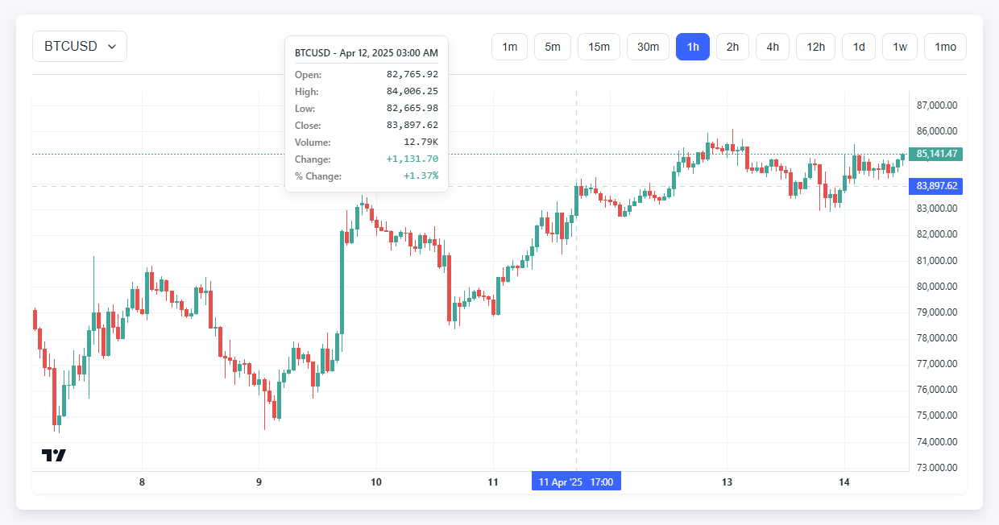

# TradingView Chart Demo



## Overview

This is a JavaScript application that demonstrates using TradingView's Lightweight Charts library with our Candle REST and WebSocket APIs. This repo may be useful for bootstrapping future clients who want to use TradingView (or a similar charting library).

Primarily we want to illustrate optimal ways to:

- Quickly switch between widths without delay to WebSocket messages
- Load instruments that are non-trading (e.g., over the weekend), using market hours to efficiently query for last data without many redundant API requests
- Seamlessly load in history when continuously panning and zooming viewport
- Cache history so that returning to the same symbol and width does not require duplicate API requests

## Prerequisites

- Docker and Docker Compose
- Client credentials for API access

## Running

### Setup Environment Variables

1. Create a `.env` file at the root directory by copying the example:

   ```bash
   cp .env.example .env
   ```

2. Edit the `.env` file and add your client credentials:

   ```
   CLIENT_ID=your_client_id_here
   CLIENT_SECRET=your_client_secret_here
   REFERER=your_referer_here
   ```

### Start the Application

Run the application using Docker Compose:

```bash
docker-compose up
```

Once running, open your browser and navigate to `http://localhost:1234`

## Notes

- Never commit the `.env` file to version control (it's added to `.gitignore`)
- If port 1234 is already in use, change the port mapping in docker-compose.yml
- If you encounter permission issues, you might need to run the Docker commands with sudo on Linux
